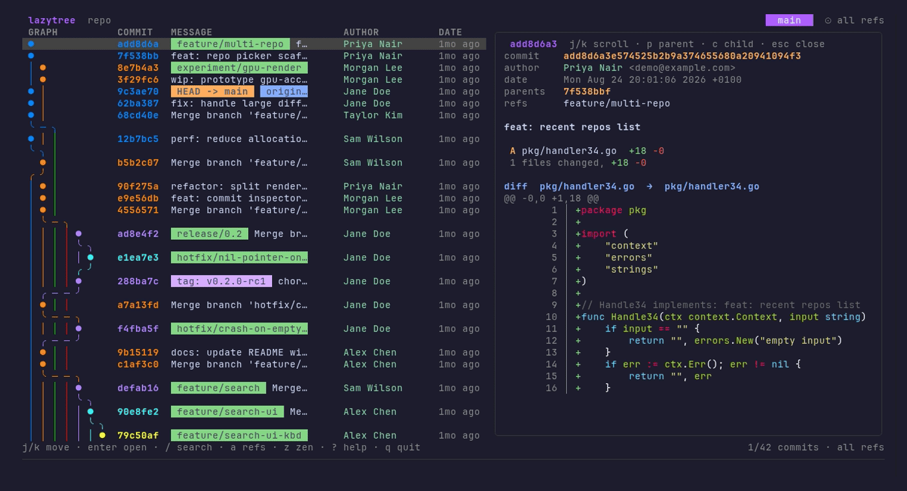
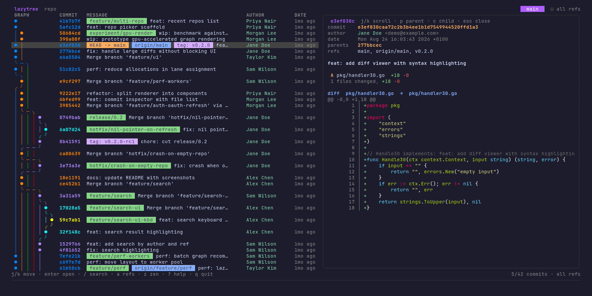
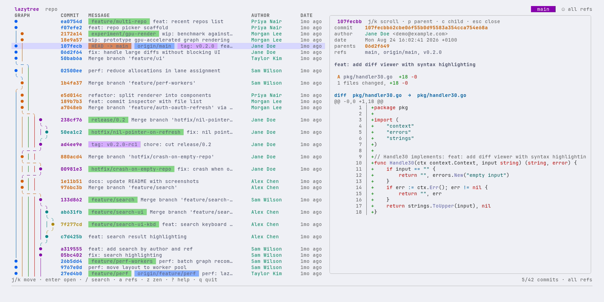
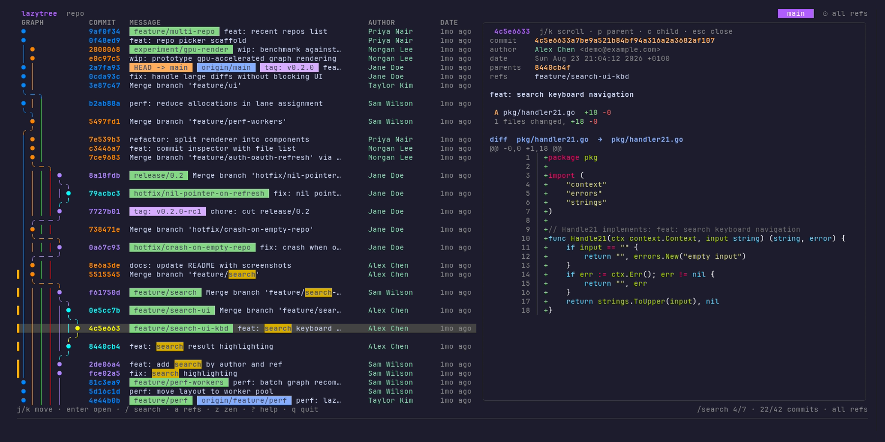
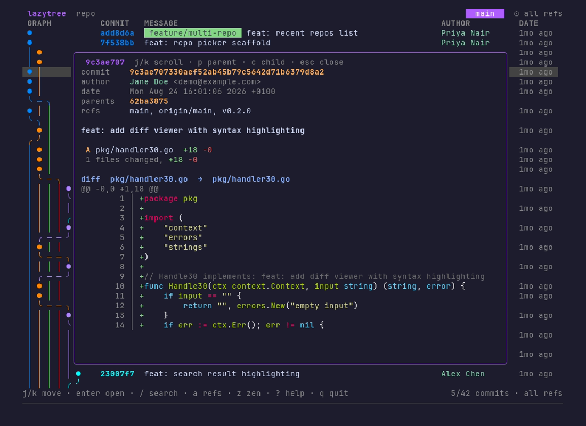
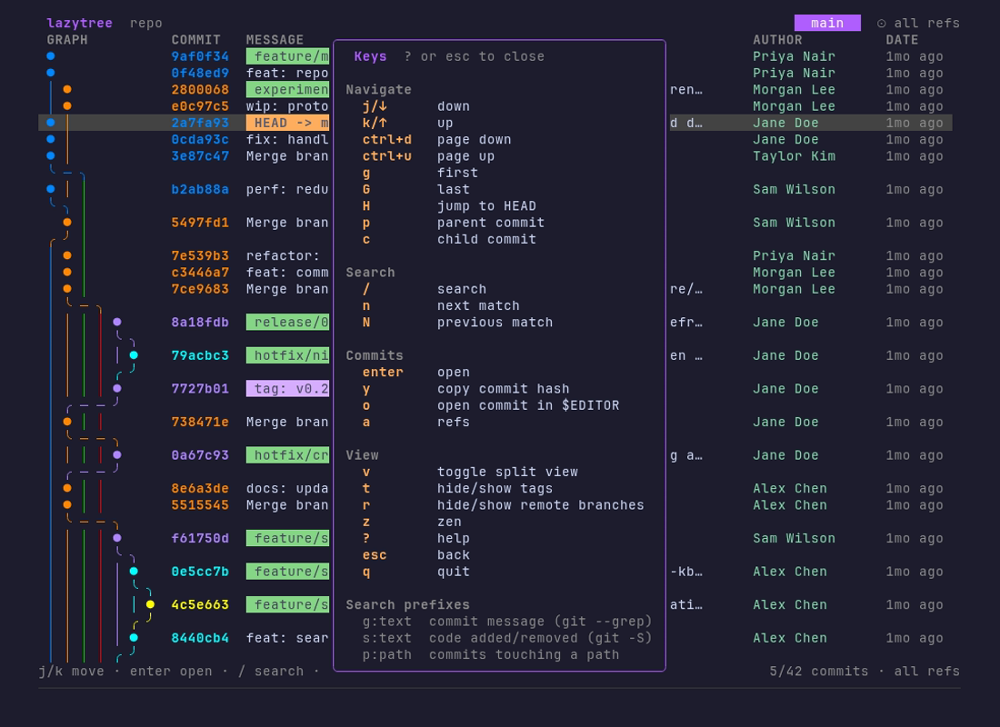
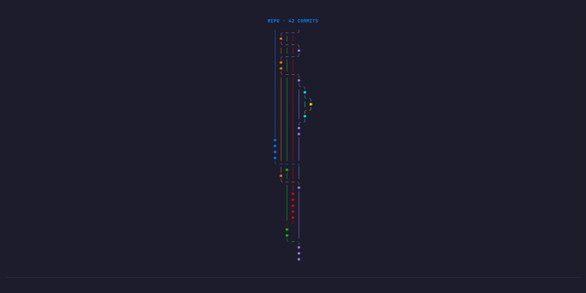

<h1 align="center">lazytree</h1>

<p align="center">
  <b>A fast, keyboard-driven terminal UI for exploring Git history.</b><br>
  See the real shape of a repository: branches, merges, tags, and every commit's diff, without leaving the terminal.
</p>

<p align="center">
  
  
  
</p>

<p align="center">
  
</p>

`lazytree` answers one question: **"What happened in this repository, and how did we get here?"**
It is inspired by `gitk --all` for history topology and `lazygit` for keyboard-driven UX, and it is strictly **read-only**: it never changes your repository.

## Features

- **A real commit graph.** Colored lanes, merge and branch connectors, and ref labels for HEAD, branches, remotes, tags and the latest stash (drawn as one commit off where you stashed), with all refs shown by default (`--all`).
- **Commit inspector.** Full hash, author and committer, date, parents, refs, message body, and a per-file `+/-` summary.
- **Syntax-highlighted diffs** with line numbers, rename and binary-file handling, shown next to the log (split view) or as a popup.
- **Search that finds things.** Incremental, highlighted search over messages, bodies, authors, hashes and ref names, plus `git`-powered search by message, code or path across the *whole* history.
- **Fast on big repositories.** Streams history instead of loading it all up front; a synthetic 108k-commit repo loads in about a second and scrolls in well under a millisecond per frame (see [Performance](#performance)).
- **Live.** Fetches in the background and refreshes when refs change, with a countdown bar showing the next fetch.
- **Navigate like a graph.** Jump to HEAD, follow parent and child commits, mouse wheel and click.
- **Looks right everywhere.** Colors adapt to light and dark terminals, and rows are clipped cleanly on narrow ones.
- **Configurable.** Remap keys, change colors, filter ref labels, pick the layout. Everything is optional.
- **Zen mode.** An ambient, animated view of your repository's tree.

## Screenshots

<table>
  <tr>
    <td width="50%"><br><sub><b>Split view</b> (dark): the diff follows the cursor</sub></td>
    <td width="50%"><br><sub><b>Split view</b> (light): same UI, light-terminal colors</sub></td>
  </tr>
  <tr>
    <td width="50%"><br><sub><b>Search</b>: highlighted matches, <code>n</code>/<code>N</code> to jump, position in the footer</sub></td>
    <td width="50%"><br><sub><b>Inspector popup</b> on narrower terminals</sub></td>
  </tr>
  <tr>
    <td width="50%"><br><sub><b>Help</b>: press <code>?</code> for every key binding</sub></td>
    <td width="50%"><br><sub><b>Zen mode</b>: your history as a growing tree</sub></td>
  </tr>
</table>

## Installation

**Prebuilt binary** (Linux and macOS, amd64 and arm64): download the archive for your system from the [releases page](https://github.com/eurico-martins/lazytree/releases), unpack it and put `lazytree` on your `PATH`.

**With Go** (1.26.5 or newer):

```bash
go install github.com/eurico-martins/lazytree/cmd/lazytree@latest
```

**From source:**

```bash
git clone https://github.com/eurico-martins/lazytree
cd lazytree
make build        # produces ./lazytree
```

`git` must be installed and on your `PATH`. Windows is not supported yet.

## Usage

```bash
lazytree                  # the repository containing the current directory
lazytree /path/to/repo    # any repository, worktree, submodule or bare repo
lazytree --version
```

Press `?` inside lazytree for the key bindings.

### Key bindings

| Key | Action |
|-----|--------|
| `j` `k` / `↓` `↑` | Move down / up |
| `ctrl+d` `ctrl+u` | Page down / up |
| `g` `G` | First / last commit |
| `H` | Jump to HEAD |
| `p` `c` | Parent / child commit (also inside the diff) |
| `1`–`9` | Jump to the nth parent of a merge (numbered in the diff header) |
| `enter` | Open the diff (focus it in split view) |
| `esc` | Back, or clear the search |
| `/` | Search (see below) |
| `n` `N` | Next / previous match |
| `y` | Copy the commit hash |
| `o` | Open the commit's patch in `$VISUAL` / `$EDITOR` |
| `a` | Toggle all refs / current branch only |
| `t` `r` | Hide / show tags / remote branches |
| `v` | Toggle split view and popup |
| `z` | Zen mode |
| `?` | Key bindings |
| `q` `ctrl+c` | Quit |

The mouse wheel scrolls the log (or the diff when the pointer is over it) and a click selects a commit. Hold <kbd>Shift</kbd> while dragging to select text in most terminals.

### Search

Plain text searches what is already loaded, and updates as you type: commit message and body, author, hash and ref names. Matches are highlighted, the cursor jumps to the first one, and `enter` keeps the search so `n` and `N` move between matches.

Three prefixes ask `git` to search the **entire** history instead, on `enter`:

| Prefix | Finds | Runs |
|--------|-------|------|
| `g:text` | commits whose message contains the text | `git log --grep` |
| `s:text` | commits that added or removed the text in code | `git log -S` |
| `p:path` | commits that touched a path | `git log -- path` |

## Configuration

Everything is optional. lazytree reads `~/.config/lazytree/config.toml` (or `$XDG_CONFIG_HOME/lazytree/config.toml`). A typo is reported at startup instead of being silently ignored.

```toml
fetch_interval = "60s"   # background `git fetch --all`; "off" disables it (minimum 5s)
show_all = true          # start with all refs rather than the current branch
theme = "auto"           # auto | light | dark   (auto detects the terminal background)
layout = "auto"          # auto (side-by-side diff on 140+ columns) | split | popup

hide_tags = false
hide_remotes = false
hide_refs = ["origin/dependabot/*"]    # ref-name globs to hide; "*" matches anything
lane_colors = ["#5f87ff", "208"]       # replace the graph lane colors

[keys]                   # rebind actions: action = ["key", ...]
zen = ["x"]

[colors]                 # override colors with "#rrggbb" or an ANSI number 0-255
hash = "#ff8700"
```

<details>
<summary>Key action names and color names</summary>

**Actions:** `up` `down` `page_up` `page_down` `top` `bottom` `enter` `back` `search` `next_match` `prev_match` `parent` `child` `head` `copy` `edit` `toggle_refs` `toggle_tags` `toggle_remotes` `split` `zen` `help` `quit`

**Colors:** `selected` `hash` `author` `date` `help` `border` `accent` `title` `error` `head` `branch` `remote` `tag` `stash` `added` `removed` `diff_file` `diff_hunk`

A key can only be bound to one action, `ctrl+c` always quits, and a color applies to both light and dark terminals.
</details>

## Performance

lazytree streams `git log` and lays the graph out incrementally, so the first screen appears almost immediately and the rest fills in behind it. Measured on a synthetic repository with 108,335 commits and 8 branches (`make perf`):

| | |
|---|---|
| First page of commits | ~14 ms |
| Whole history loaded | ~1.2 s |
| Memory after loading | ~54 MiB |
| One cursor move plus redraw | ~0.3 ms |
| Search across all commits | ~20 ms |

## How it works

```
git (external process)
  └─ internal/git     runs git, parses log / refs / diffs, streams history
      └─ internal/model     plain data types (Commit, Ref, DiffFile, ...)
          └─ internal/graph      lane assignment and graph rendering (no UI dependency)
              └─ internal/ui     Bubble Tea models and Lip Gloss views
                  └─ cmd/lazytree    entry point: config, repository detection
```

The graph layout has no dependency on the TUI framework and is tested on its own. All git work happens off the UI thread and arrives as messages, so the interface never blocks. It is built with [Bubble Tea](https://github.com/charmbracelet/bubbletea), [Lip Gloss](https://github.com/charmbracelet/lipgloss) and [Chroma](https://github.com/alecthomas/chroma).

## Development

```bash
make build            # build ./lazytree
make test             # run all tests
make check            # lint, tests, and a compile check for Linux, macOS and Windows
make docker-matrix    # tests in clean containers: Debian x2 and Alpine (git 2.39 to 2.54)
make perf             # large-repository timings on a synthetic 100k-commit repo
make demo             # run against a generated multi-branch repository
make screenshots      # regenerate docs/img (needs Docker)
make help             # every target
```

Releases are prepared locally and never published automatically: `make release VERSION=v1.0.0` runs the checks, creates the tag, builds the archives and writes the release text; you push the tag and upload the files yourself. See `scripts/release.sh`.

## Status

lazytree is early software (pre-1.0). Linux and macOS are supported; Windows is not tested. Planned: Homebrew and AUR packages. Ideas and bug reports are welcome.

## License

MIT. See [LICENSE](LICENSE).
